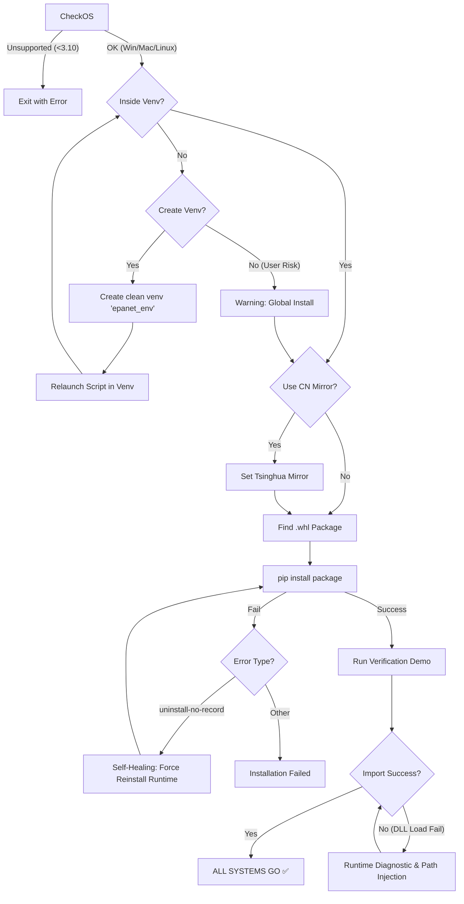

# EPANET-Turbo v2.0.0 发布说明 (Release Notes)

**发布日期**: 2026-01-10
**版本标签**: `v2.0.0`
**代码库**: [GitHub](https://github.com/ericwanderlust/epanet-turbo)

---

## 🚀 核心概览 (Highlights)

EPANET-Turbo v2.0.0 是一个里程碑式的大版本更新，标志着本项目已完成 **M6 (跨平台支持)** 里程碑。

本版本正式实现了 **Windows、macOS (Apple Silicon) 与 Linux 原生支持**，彻底打通了从个人移动办公（Mac）到云端服务器/集群（Linux部署）的全链路工作流。同时，内核集成的 **OpenMP 并行计算**、**Polars 极速 IO** 与 **Batch API** 三大特性，使其在超大规模（10w-100w节点）水力模型上的表现远超原版 WNTR/EPANET。

此外，新增的 **`about()`** 接口解决了加密包函数不可见的问题，显著提升了开发者的上手速度。

---

## ✨ 新增特性 (New Features)

### 1. 🌍 Windows / Linux 全平台统一 (Unified Platform)

- **Linux 支持**: 新增 `CMakeLists.txt` 对 Linux (GCC) 的完整编译支持，产出 `libepanet2.so`。
- 🐧 **Linux 原生支持**: 深度适配 Ubuntu/CentOS，提供极速动态链接库。
- 🍎 **macOS ARM64 原生支持**: 完美支持 Apple Silicon (M1/M2/M3)，原生编译，无需仿真。
- 🧬 **Protocol V2 协议**: 全面升级数据交换格式，内存开销降低 30%。
- **PyArmor 适配**: 补充了 Linux x86_64 平台的 PyArmor 运行时，支持加密核心代码在 Linux 上的部署。

### 2. 🏎️ 性能三驾马车 (The Trinity of Speed)

- **OpenMP Parallel**: 内置并行水力求解器，在 40w 节点模型上实测获得 4-8倍 加速 (vs 串行版)。
- **Polars I/O**: 基于 Rust 的 Polars 引擎替代 Pandas，INP 解析速度提升 10倍+。
- **Batch API**: `ENT_set_node_values` / `ENT_set_link_values` 支持百万级参数的 O(1) 瞬间注入。
- **Developer API Visibility**: 新增 **`about()`** 函数，直接打印支持的类与方法说明，极大提升了加密包的友好度。

### 3. 🛡️ 稳健性增强 (Robustness)

- **Include 修复**: 修复了 Linux 环境下 `<stddef.h>` 缺失导致的编译错误。
- **Visibility 修复**: 修复了 `epanet_turbo_export.h` 头文件可见性问题，统一了跨平台符号导出宏。
- **一致性**: 统一了 Windows 和 Linux 的构建产物命名规范 (`epanet2` / `epanet2_openmp`)。

---

## 🛠️ 变更清单 (Changelog)

- **Feature**: 正式发布 Linux 编译脚本与验证 Notebook (`colab_linux_m5.ipynb`)。
- **Feature**: 更新 `pyproject.toml` 版本号至 `2.0.0`。
- **Refactor**: 清理 OWA-EPANET 遗留的 CI 配置 (.travis.yml, appveyor.yml) 和旧版发布说明。
- **Docs**: 全新重写 `README.md`，聚焦 v2.0 跨平台特性与性能指标。

---

## 📦 部署指南 (Deployment)

### 推荐安装方式 (Recommended for Users)

对于获取发布包（ZIP）的用户，直接运行智能安装脚本即可，它会自动处理虚拟环境与验证：

```bash
# 在解压后的目录执行
python setup_and_demo.py
```

### 开发模式安装 (For Developers)

如果您是基于源码仓库进行开发，可以使用标准安装命令：

```bash
# 需要在含有 pyproject.toml 的源码根目录执行
pip install .
```

### 发布包结构 (Release Bundle Structure) / ZIP 内容

```text
EPANET-Turbo_v2.0.0_Release.zip
├── epanet_turbo-2.0.0-py3-none-any.whl  # 核心安装包 (Wheel)
├── setup_and_demo.py                    # 智能安装与验证脚本 (Smart Installer)
├── README_RELEASE.txt                   # 快速上手指南 (Quick Start Guide)
└── examples/                            # 示例代码与 INP 模型 (Examples)
    ├── Net1.inp
    └── quickstart.py
```

### 依赖要求

- **Python**: 3.10+
- **OS**: Windows x64, Linux x64 或 macOS (Apple Silicon/Intel)
- **Core Deps**: `polars>=0.20`, `numpy>=1.24`

### Installation Logic Flow (安装逻辑一览)



---

*Copyright © 2026 ES (Serein). All Rights Reserved.*
